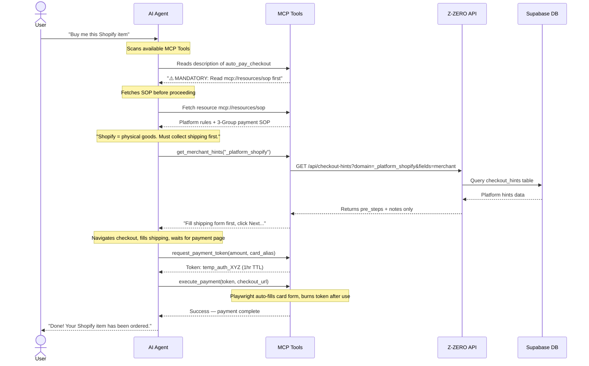

# OpenClaw: Z-ZERO AI Agent MCP Server

A Zero-Trust Payment Protocol built for AI Agents using the [Model Context Protocol (MCP)](https://modelcontextprotocol.io). Give your agents (Claude, Cursor, Antigravity) the ability to make real-world purchases — securely, without ever seeing a real card number.

**What makes it different:**
- 🔐 **Zero-trust** — AI never sees PAN, CVV, or expiry. Card data exists only in RAM, injected via Playwright, then wiped.
- 🌐 **Web3 + Fiat** — Auto-detects crypto checkout (EIP-681) and routes to on-chain USDT transfer. Falls back to JIT Visa for fiat.
- 🧠 **Smart Routing** — Cloud Knowledge Base (`get_merchant_hints`) provides platform-specific checkout playbooks for Shopify, Etsy, WooCommerce, and more.
- 🔄 **Self-Healing** — Failed checkouts are logged via `report_checkout_fail` for admin review, improving future success rates.

---

## How It Works



---

## Quick Install (Recommended)

```bash
npx z-zero-mcp-server
```

Add to your Claude Desktop config (`~/Library/Application Support/Claude/claude_desktop_config.json`):

```json
{
  "mcpServers": {
    "openclaw": {
      "command": "npx",
      "args": ["-y", "z-zero-mcp-server@latest"],
      "env": {
        "Z_ZERO_API_KEY": "zk_live_your_passport_key_here"
      }
    }
  }
}
```

Get your Passport Key at: **[clawcard.store/dashboard/agents](https://www.clawcard.store/dashboard/agents)**

---

## Requirements

- **Node.js v18+** — [nodejs.org](https://nodejs.org)
- **Passport Key** — starts with `zk_live_`, get it from the dashboard above

---

## Available MCP Tools

### Group 1 — Wallet Config (Passive)

| Tool | Description |
|------|-------------|
| `list_cards` | List all virtual card aliases and balances |
| `check_balance` | Check spendable USD balance for a card alias |
| `get_deposit_addresses` | Get crypto deposit addresses (EVM + Tron) to top up balance |
| `set_api_key` | Activate a new Passport Key instantly, no restart needed |
| `show_api_key_status` | Check if a Passport Key is currently loaded (prefix only) |

### Group 2 — Manual 4-Step Payment (Active)

| Tool | Description |
|------|-------------|
| `request_payment_token` | Issue a JIT single-use Visa token for a specific amount (1hr TTL) |
| `execute_payment` | Auto-fill checkout form using a payment token via Playwright |
| `cancel_payment_token` | Cancel an unused token and refund to wallet |
| `request_human_approval` | Pause and request human confirmation before proceeding |

### Group 3 — Smart Autopilot

| Tool | Description |
|------|-------------|
| `auto_pay_checkout` | Fully autonomous checkout — auto-detects Web3 or Fiat and completes payment |
| `get_merchant_hints` | Fetch platform-specific checkout playbook (pre-steps + selectors) from Knowledge Base |
| `report_checkout_fail` | Log a failed checkout URL for admin review (self-healing feedback loop) |

> 📖 **Note:** Version checking is handled automatically in each API call. No separate tool needed.

---

## REST API Reference

The Z-ZERO backend is hosted at `https://www.clawcard.store`. All endpoints require a `Bearer` token using your Passport Key.

> ⚠️ **Use the MCP tools above instead of calling REST directly.** If you must call REST, use the exact paths below.

### `GET /api/tokens/cards`
Returns your card list, balance, and deposit addresses.
```bash
curl -X GET "https://www.clawcard.store/api/tokens/cards" \
  -H "Authorization: Bearer zk_live_your_key"
```

**Aliases (also work):**
- `GET /api/v1/cards` ← for agents that guess REST-style paths

### `POST /api/tokens/issue`
Issue a JIT payment token.

### `POST /api/tokens/resolve`
Resolve a token to card data (server-side only).

### `POST /api/tokens/burn`
Burn a used token.

### `POST /api/tokens/cancel`
Cancel an unused token (refunds balance).

---

## Troubleshooting

### "Z_ZERO_API_KEY is missing"
1. Go to [clawcard.store/dashboard/agents](https://www.clawcard.store/dashboard/agents)
2. Copy your Passport Key (starts with `zk_live_`)
3. Add it to your config as `Z_ZERO_API_KEY`
4. **Restart** Claude Desktop / Cursor

### "Invalid API Key" (401)
- Double-check you copied the full key (e.g. `zk_live_c0g3l`)
- Make sure there are no extra spaces or line breaks

### "404 Not Found" on `/api/v1/cards`
- This is a legacy path alias — it should now work. If not, use `/api/tokens/cards` directly.

---

*Security: OpenClaw never stores your Passport Key. It is passed via environment variables and card data exists only in volatile RAM during execution.*
