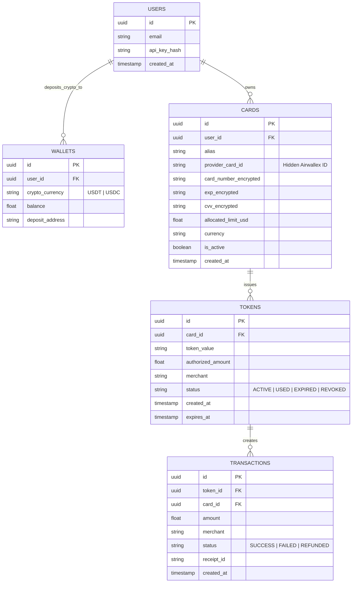
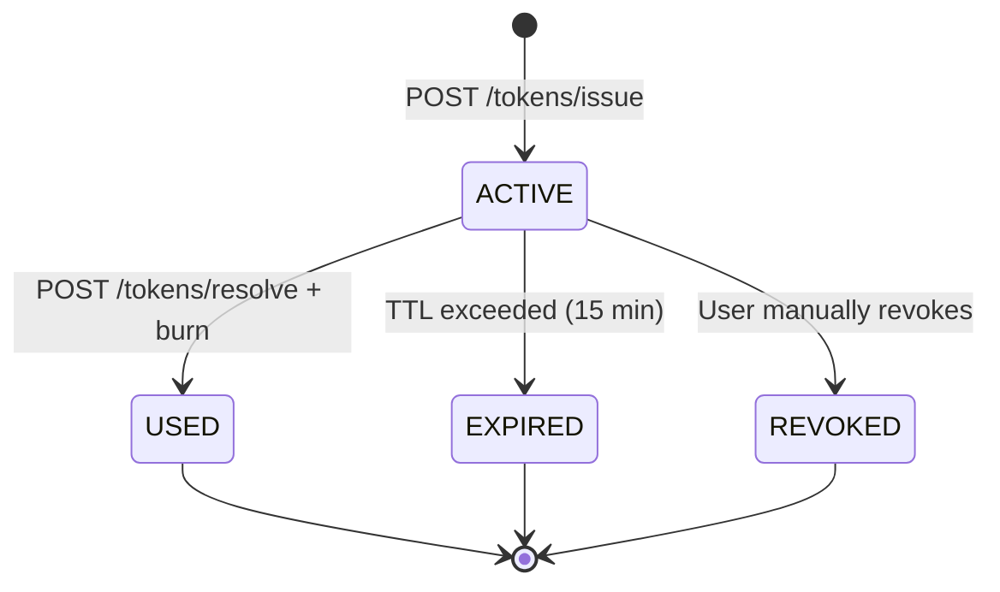

# Backend Architecture: Neobank API for AI Virtual Cards

## Overview
This document defines the real backend that will replace `mock_backend.ts` in production. It acts as a **Crypto-to-Fiat Bridge** and uses **Supabase** (PostgreSQL + Edge Functions) for rapid deployment.

### Issuer Abstraction Layer (Bảo mật Bí mật Kinh doanh)
Crucially, the Z-ZERO backend sits BETWEEN the client (Web/MCP) and the actual Neobank providers (e.g., Airwallex, Stripe Issuing).
- Clients send API requests to `api.z-zero.com`.
- Supabase Edge Functions securely call the Airwallex APIs using private backend keys.
- **Result:** The business logic, fiat rails, and specific partners (Airwallex) remain a "Trade Secret" invisible to the end-users and their AI agents.

## Database Schema (Supabase / PostgreSQL)



## API Endpoints (Supabase Edge Functions)

### Authentication
All requests require header: `Authorization: Bearer <user_api_key>`

### Core Endpoints

| Method | Endpoint | Description |
|---|---|---|
| `GET` | `/cards` | List user's virtual cards (alias + balance only) |
| `POST` | `/cards` | Create a new virtual card |
| `GET` | `/cards/:alias/balance` | Check card balance |
| `POST` | `/tokens/issue` | Issue a JIT payment token |
| `POST` | `/tokens/resolve` | Exchange token for card data (MCP Server only) |
| `POST` | `/tokens/burn` | Invalidate a token after use |
| `GET` | `/transactions` | Transaction history for reconciliation |

### Token Lifecycle



### Key API Flows

#### Issue Token
```
POST /tokens/issue
Body: { "card_alias": "Card_01", "amount": 25.00, "merchant": "stripe.com" }
Response: { "token": "temp_auth_a1b2c3d4", "expires_at": "2026-03-01T01:15:00Z" }
```

#### Resolve Token (Called ONLY by MCP Server, NOT by AI)
```
POST /tokens/resolve
Body: { "token": "temp_auth_a1b2c3d4" }
Response: { "number": "4242...4242", "exp": "12/30", "cvv": "123", "name": "AI Card 01" }
⚠️ This endpoint MUST be rate-limited and IP-whitelisted
```

#### Burn Token
```
POST /tokens/burn
Body: { "token": "temp_auth_a1b2c3d4", "receipt_id": "rcpt_abc123" }
Response: { "status": "BURNED", "transaction_id": "txn_xyz" }
```

## Security Layers

| Layer | Implementation |
|---|---|
| **Encryption at Rest** | Card numbers encrypted with AES-256 in Supabase |
| **Resolve Endpoint** | IP-whitelisted to MCP Server only |
| **Token TTL** | PostgreSQL trigger auto-expires after 15 min |
| **Rate Limiting** | Max 10 tokens/minute per user |
| **Audit Log** | Every resolve/burn logged with IP + timestamp |

## Reconciliation (Đối Soát Giao Dịch)

Dashboard query for the card owner:
```sql
SELECT 
    t.created_at,
    t.amount,
    t.merchant,
    t.status,
    t.receipt_id,
    c.alias as card_used
FROM transactions t
JOIN cards c ON t.card_id = c.id
WHERE c.user_id = :current_user
ORDER BY t.created_at DESC;
```

## Deployment Plan
1. **Supabase Project** → Create tables + RLS policies
2. **Edge Functions** → Deploy token/issue, token/resolve, token/burn
3. **Update MCP Server** → Replace `mock_backend.ts` imports with real Supabase API calls
