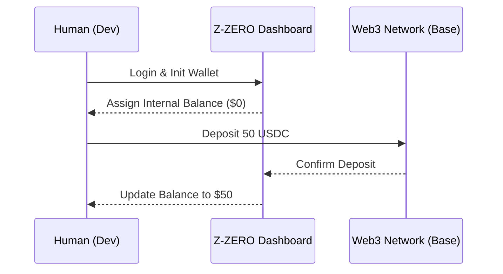
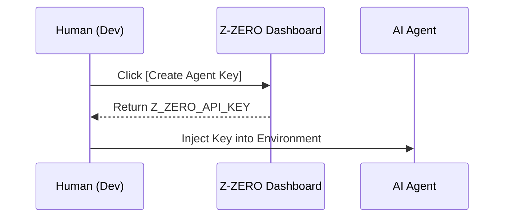
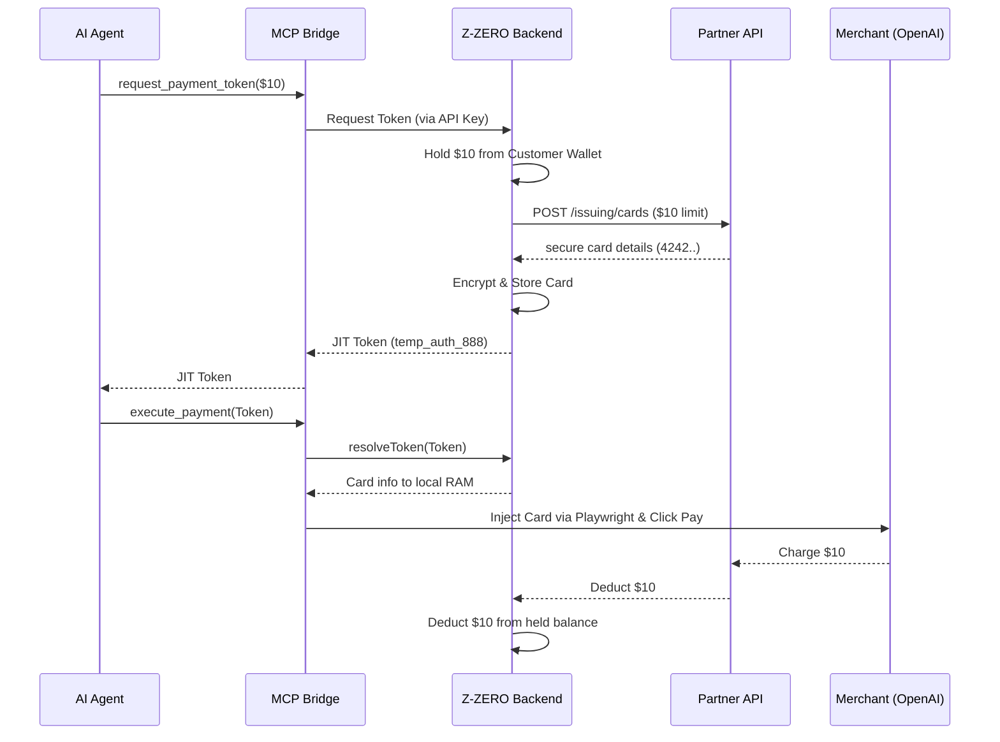
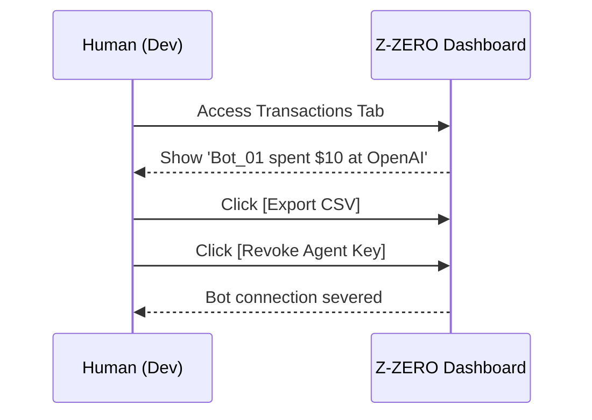

# Z-ZERO Web Platform Flow (Crypto-to-Fiat)

## Relationship Between Entities (The Actors)
1. **User (Human/Dev):** Deposits Crypto, manages Agents, views reports.
2. **AI Agent (Bot):** Runs MCP, has no UI, only an API Key, uses Tokens to make purchases.
3. **Z-ZERO System (Backend):** Acts as the intermediary, holding the customer's Crypto (collateral) and calling the Issuer API (real fiat money) to complete purchases.
4. **Partner Card Issuer:** Visa/Mastercard issuing partner, completely unaware of the end-user or AI Agent. It only identifies Z-ZERO as the corporate entity using the service.

## Core Operational Flow & Use Cases

### Flow 1: Onboarding & Deposit (Crypto Funding)
Goal: Pre-fund the system without a real credit card.

1. **Access Web Portal:** Dev visits `app.z-zero.com`, Logs in via Email or Web3 WalletConnect (MetaMask/Phantom).
2. **Initialize Internal Wallet:** The system provisions an `Internal USD Balance` for the Dev (Initially = $0).
3. **Deposit Funds:** 
   - Dev chooses to deposit 50 USDC via Base network (low gas fees).
   - System monitors the Smart Contract. Receives 50 USDC.
   - System adds +$50 to the `Internal USD Balance` displayed on the Web Dashboard.

### Flow 2: Provisioning (Creating the "Agent Passport")
Goal: Grant payment capability to a machine without exposing the web account.

1. On the Web Dashboard, Dev clicks `[Create Agent Key]`.
2. The system generates a `Z_ZERO_API_KEY` (e.g., `zk_live_1234abc`).
3. The customer copies this Key and places it into their Bot's environment alongside the MCP Server config.
*(From this moment on, the Bot has delegated access to the customer's $50 wallet).*

### Flow 3: The JIT Payment Execution (Core Payment Loop)
Goal: The AI autonomously shops using a partner's issuing rails, but is completely blind to who the partner is or the real card details.

1. AI Agent decides to buy a $10 SaaS subscription. It calls the MCP tool `request_payment_token()`.
2. **Z-ZERO Backend Processing (Hidden):**
   - Checks if the customer's `Internal USD Balance` > $10.
   - **Hold:** Temporarily locks $10 in the customer's wallet (Available balance becomes $40).
   - **Call Issuer API:** Backend calls the proprietary API of the Card Partner: `POST /api/v1/issuing/cards` with a $10 spending limit.
   - Partner returns the real card details (4242... CVV 123). The Backend SECURELY SAVES THIS CARD to Z-ZERO's encrypted database.
   - Backend returns a JIT Token `temp_auth_888` to the AI Agent (Completely blind to the card number).
3. AI Agent passes the Token into `execute_payment()`.
4. MCP Bridge contacts the Backend, resolves the real card details in local RAM, injects it into the merchant's DOM, and clicks Pay.
5. Merchant charges the Partner card. Partner deducts $10 from Z-ZERO's corporate account.
6. **Reconciliation:** Transaction succeeds, Z-ZERO permanently deducts the held $10 from the customer. 
*(If the transaction fails, the Partner card is burned, and Z-ZERO releases the $10 hold back to the customer).*

### Flow 4: Management & Analytics (B2B Admin)
Goal: Provide peace of mind and strict control for human operators.

1. Dev accesses the Web Dashboard.
2. Under the `Transactions` tab, Dev sees: `Time: 10:00 AM | Merchant: OpenAI | Amount: $10.00 | Agent: Bot_01`.
3. Customer can click `[Export CSV]` for internal accounting.
4. If a bot starts spending erratically, Dev can click `[Revoke Agent Key]` to instantly sever the Bot's connection to the wallet.
